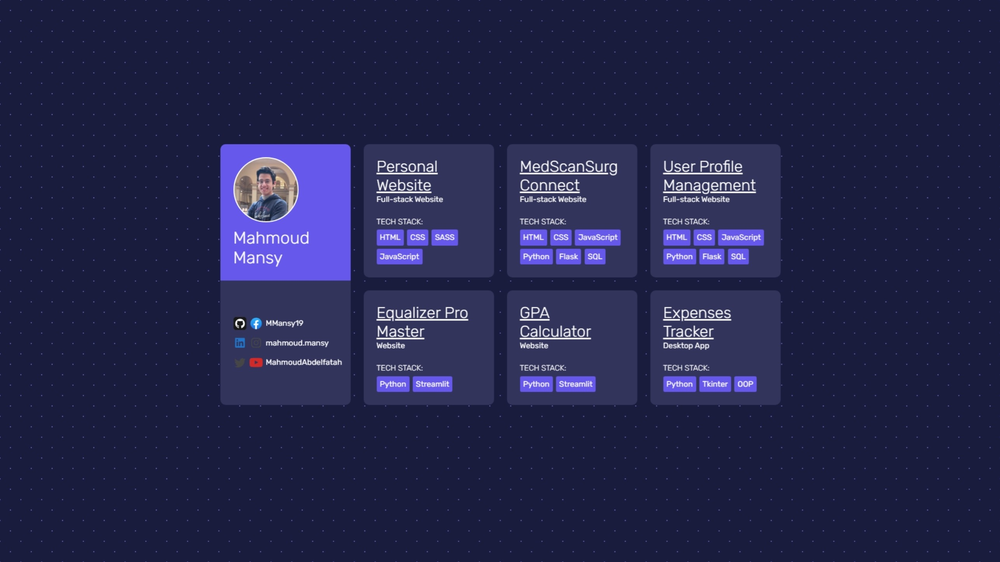

# Projects Showcase: DevInnovate Hub
## [🌟Live Website🌟](https://main--mmansy-portfolio.netlify.app/)
## Overview
DevInnovate Hub is a portfolio dashboard that showcases my various projects, highlighting skills and technologies used in each. It serves as a centralized hub for professionals, recruiters, and fellow developers to explore my work and expertise.
## Picture 

## Skills Utilized
- **HTML:** Used to structure the content of web pages.
- **CSS:** Employed for styling and layout enhancements.
- **SASS:** Utilized to streamline and enhance the CSS styling process.
- **Responsive Design:** Ensured a seamless user experience across various devices and screen sizes.

## Features
- **Profile Card:** Display personal information, including a profile picture and a brief introduction.
- **Social Links:** Connect with me through GitHub, LinkedIn, Twitter, and other social media platforms.
- **Project Cards:** Highlight key projects with details on technologies, type, and a link to the project.
- **Tech Stack:** Provide a quick overview of the technologies used in each project.

## How to Use
1. Clone the repository: `git clone https://github.com/MMansy19/Projects-Showcase.git`
2. Open the `index.html` file in a web browser.

## Author
- **Name:** Mahmoud Mansy
- **Contact:** [Email](mailto:mahmoud2abdalfattah@gmail.com)

## License
This project is licensed under the MIT License - see the [LICENSE](LICENSE) file for details.
